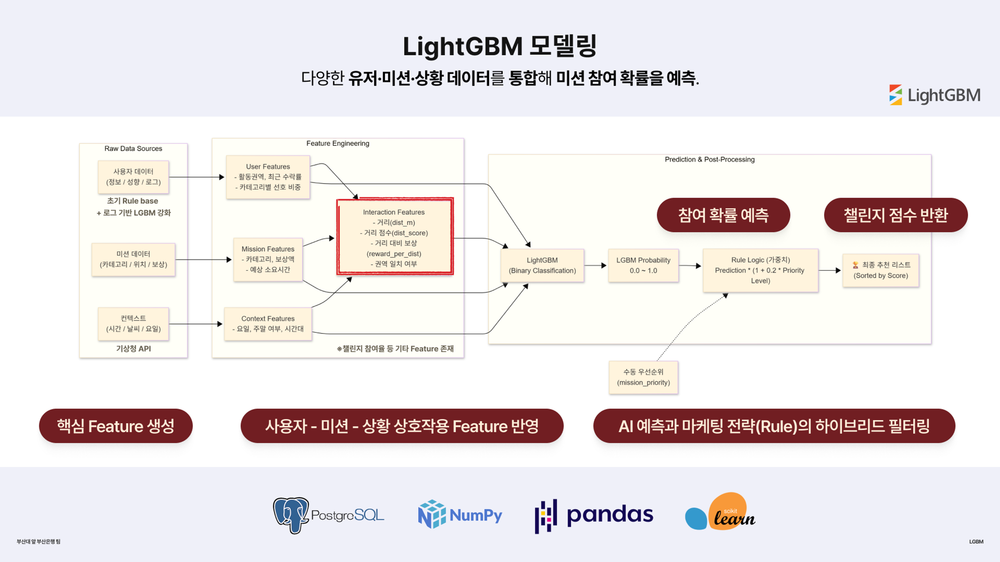

# 🏙️ BNK 로컬 챌린지 추천 시스템

[](https://fastapi.tiangolo.com/)
[](https://www.python.org/)
[](https://lightgbm.readthedocs.io/)
[](LICENSE)

> 부산 지역 기반 **O2O 플랫폼**을 위한 **LightGBM 기반 미션 추천 REST API**  
> ML 모델 추론 + 비즈니스 규칙(Priority Weight) 하이브리드 추천 시스템

---

## 🧠 ML 아키텍처



이 다이어그램은 현재 프로젝트의 핵심 모델링 흐름과 맞닿아 있습니다.

- 사용자 feature, 미션 feature, 상황 feature를 결합
- 상호작용 feature를 생성
- LightGBM으로 참여 확률 추론
- Priority Weight를 후처리로 반영해 최종 추천 점수 계산

실제 구현은 `api_server.py`, `missions.csv`, `BNK.ipynb`에 반영되어 있습니다.

---

## 📌 주요 특징

- ✅ **LightGBM Binary Classifier** - 17개 Feature, AUC ~0.85-0.90
- ✅ **FastAPI REST API** - Swagger UI 자동 생성, CORS 지원
- ✅ **Hybrid Scoring** - ML 확률 + Priority Weight 결합
- ✅ **Cold Start 해결** - 합성 데이터 기반 초기 모델 구축
- ✅ **MLOps Ready** - 데이터 수집 → 재학습 → 모델 버전 관리 사이클
- ✅ **Production Ready** - Docker 배포, 로깅, 모니터링 가이드 포함

---

## 🚀 Quick Start

### 1️⃣ 설치

```bash
# 저장소 클론

# 가상환경 생성 및 활성화
python -m venv venv
source venv/bin/activate  # Windows: venv\Scripts\activate

# 패키지 설치
pip install -r requirements.txt
```

### 2️⃣ 모델 학습 (선택사항)

이미 학습된 `model_v2.pkl`이 포함되어 있으므로 바로 API 실행 가능합니다.  
모델을 직접 재학습하려면:

```bash
# Jupyter Notebook 실행
jupyter notebook BNK.ipynb

# Step 0~9까지 순차 실행
# → model_v2.pkl, missions.csv 생성
```

### 3️⃣ API 서버 실행

```bash
# 개발 모드 (자동 리로드)
uvicorn api_server:app --reload

# 프로덕션 모드
uvicorn api_server:app --host 0.0.0.0 --port 8000
```

**서버 주소:**
- 🌐 API: http://localhost:8000
- 📚 Swagger UI: http://localhost:8000/docs
- ❤️ Health Check: http://localhost:8000/health

### 4️⃣ API 테스트

```bash
# 새 터미널에서 테스트 클라이언트 실행
python test_client.py
```

---

## 📡 API 사용 예시

### POST /recommend - 미션 추천

```bash
curl -X POST http://localhost:8000/recommend \
  -H "Content-Type: application/json" \
  -d '{
    "user_id": "U0001",
    "age": 25,
    "gender": "M",
    "user_lat": 35.2318,
    "user_lon": 129.0824,
    "pref_tags": ["Food", "Cafe"],
    "acceptance_rate": 0.15,
    "active_time_slot": "Day",
    "current_day_of_week": 3,
    "current_weather": "Sunny"
  }'
```

**Response:**
```json
{
  "user_id": "U0001",
  "timestamp": "2025-12-06T14:30:00",
  "total_missions": 23,
  "recommendations": [
    {
      "mission_id": "M002",
      "title": "부산대 앞 토스트 골목 간식타임",
      "category": "Food",
      "distance_m": 1250.5,
      "priority_weight": 0,
      "model_proba": 0.7823,
      "final_score": 0.7823,
      "rank": 1
    }
  ]
}
```

### Python 클라이언트 예시

```python
import requests

response = requests.post(
    "http://localhost:8000/recommend",
    json={
        "user_id": "U0001",
        "age": 25,
        "gender": "M",
        "user_lat": 35.2318,
        "user_lon": 129.0824,
        "pref_tags": ["Food", "Cafe"],
        "acceptance_rate": 0.15,
        "active_time_slot": "Day",
        "current_day_of_week": 3,
        "current_weather": "Sunny"
    }
)

recommendations = response.json()['recommendations']
top_5 = recommendations[:5]
```

---

## 📁 프로젝트 구조

```
BNK/
├── api_server.py               # FastAPI 서버 (POST /recommend, GET /missions)
├── test_client.py              # API 테스트 클라이언트
├── BNK.ipynb                   # 모델 학습 노트북 (Step 0~9)
├── model_v2.pkl                # 학습된 LightGBM 모델 (0.64MB)
├── missions.csv                # 23개 부산 미션 데이터
├── requirements.txt            # Python 의존성 목록
├── README.md                   # 이 파일
└── docs/                       # 상세 문서
    ├── PROJECT_OVERVIEW.md     # 프로젝트 개요
    ├── MODEL_PIPELINE.md       # 모델 학습 파이프라인
    ├── API_AND_CLIENT.md       # API 명세 및 Backend 연동
    ├── DATA_PIPELINE.md        # 데이터 수집 및 재학습 가이드
    └── OPERATIONS_AND_ROADMAP.md # 운영 전략 및 로드맵
```

---

## 🛠️ 기술 스택

| Category | Technologies |
|----------|-------------|
| **ML Framework** | LightGBM, scikit-learn, pandas, numpy |
| **API Framework** | FastAPI, Pydantic, Uvicorn |
| **Data Processing** | pandas, numpy, haversine (거리 계산) |
| **Deployment** | Docker, Gunicorn, Nginx (옵션) |
| **Monitoring** | Prometheus, Grafana (권장) |

---

## 📊 데이터 스키마

### UserContext (입력)

| 필드 | 타입 | 설명 | 예시 |
|------|------|------|------|
| `user_id` | string | 유저 고유 ID | "U0001" |
| `age` | int | 나이 (20~60) | 25 |
| `gender` | string | 성별 | "M" or "F" |
| `user_lat` | float | 현재 위도 | 35.2318 |
| `user_lon` | float | 현재 경도 | 129.0824 |
| `pref_tags` | list[string] | 선호 카테고리 | ["Food", "Cafe"] |
| `acceptance_rate` | float | 누적 수락률 (0.0~1.0) | 0.15 |
| `active_time_slot` | string | 활동 시간대 | "Morning", "Day", "Evening", "Night" |
| `current_day_of_week` | int | 요일 (0=월~6=일) | 3 |
| `current_weather` | string | 날씨 | "Sunny", "Cloudy", "Rainy", "Snowy" |

### 카테고리 가능한 값: ["Food", "Cafe", "Tourist", "Culture", "Festival", "Walk", "Shopping", "Self-Dev", "Sports"]

### MissionRecommendation (출력)

| 필드 | 타입 | 설명 |
|------|------|------|
| `rank` | int | 추천 순위 (1~N) |
| `mission_id` | string | 미션 ID |
| `title` | string | 미션 제목 |
| `category` | string | 카테고리 |
| `distance_m` | float | 사용자~미션 거리(m) |
| `priority_weight` | int | 우선도 (0=일반 ~ 3=매우중요) |
| `model_proba` | float | 모델 예측 확률 (0.0~1.0) |
| `final_score` | float | 최종 점수 (priority + proba) |

---

## 🎯 사용 사례

### 1. Backend 통합 (Django/Flask/Spring)

```python
# Backend가 사용자 컨텍스트 수집 후 API 호출
import requests

def get_mission_recommendations(user_id):
    user_context = {
        'user_id': user_id,
        'age': get_user_age(user_id),
        'gender': get_user_gender(user_id),
        'user_lat': get_current_gps()[0],
        'user_lon': get_current_gps()[1],
        'pref_tags': get_user_preferences(user_id),
        'acceptance_rate': get_user_acceptance_rate(user_id),
        'active_time_slot': get_user_timeslot(user_id),
        'current_day_of_week': datetime.now().weekday(),
        'current_weather': get_weather_from_api()
    }
    
    response = requests.post('http://localhost:8000/recommend', json=user_context)
    return response.json()['recommendations'][:5]  # Top 5
```

### 2. 미션 필터링

```python
# 카테고리 필터링
food_missions = [m for m in recommendations if m['category'] == 'Food']

# 거리 필터링 (3km 이내)
nearby = [m for m in recommendations if m['distance_m'] <= 3000]

# 우선도 필터링
priority = [m for m in recommendations if m['priority_weight'] >= 2]
```

---

## 📈 모델 성능

- **AUC Score**: ~0.85 - 0.90 (합성 데이터 기준)
- **Features**: 17개 (유저 프로필 + 미션 메타 + 컨텍스트)
- **Training Data**: 10,000+ 합성 로그 + 실전 데이터 (지속 증가)
- **Cold Start 해결**: Ground Truth Rules 기반 합성 데이터

---

## 🔄 MLOps Workflow

```
1. 사용자가 앱 미션 화면 진입
   ↓
2. Backend가 POST /recommend 호출
   ↓
3. API가 23개 미션 ranking 반환
   ↓
4. 사용자가 미션 수락/거부
   ↓
5. Backend가 피드백 로그 DB 저장
   ↓
6. 데이터 축적 후 BNK.ipynb에서 재학습
   ↓
7. 새 모델(v3.pkl) 성능 비교 (AUC)
   ↓
8. 배포: model_v2.pkl → model_v3.pkl 교체
   ↓
9. API 서버 재시작 → 개선된 추천 제공
```

**상세 가이드:** [`docs/DATA_PIPELINE.md`](docs/DATA_PIPELINE.md)

---

## 🐳 Docker 배포

```dockerfile
FROM python:3.9-slim

WORKDIR /app

COPY requirements.txt .
RUN pip install --no-cache-dir -r requirements.txt

COPY api_server.py model_v2.pkl missions.csv ./

CMD ["uvicorn", "api_server:app", "--host", "0.0.0.0", "--port", "8000"]
```

```bash
# Docker 이미지 빌드 및 실행
docker build -t bnk-recommendation-api .
docker run -p 8000:8000 bnk-recommendation-api
```

---

## 🧪 테스트

```bash
# 1. API 서버 실행 (터미널 1)
uvicorn api_server:app --reload

# 2. 테스트 클라이언트 실행 (터미널 2)
python test_client.py

# 3. 또는 curl로 직접 테스트
curl http://localhost:8000/health
curl http://localhost:8000/missions
```

---

## 📚 문서

- **[프로젝트 개요](docs/PROJECT_OVERVIEW.md)** - 전체 아키텍처 및 파일 구조
- **[모델 파이프라인](docs/MODEL_PIPELINE.md)** - 데이터 생성, Feature Engineering, 모델 학습
- **[API 명세](docs/API_AND_CLIENT.md)** - 엔드포인트, Backend 연동 예시
- **[데이터 파이프라인](docs/DATA_PIPELINE.md)** - 로그 수집, 재학습 가이드
- **[운영 가이드](docs/OPERATIONS_AND_ROADMAP.md)** - 배포, 모니터링, 로드맵

Swagger UI: http://localhost:8000/docs

---

## 🔧 트러블슈팅

### CORS 에러 (Frontend 연동 시)
→ `api_server.py`의 `allow_origins`를 Frontend 도메인으로 수정

---


## 🙏 Acknowledgments

- **부산광역시 관광 데이터** - 미션 아이디어 참고
- **LightGBM** - 고성능 Gradient Boosting 프레임워크
- **FastAPI** - 현대적인 Python Web Framework

---

## 📞 Contact

- 📧 Email: your.email@example.com
- 🐛 Issues: [GitHub Issues](https://github.com/yourusername/BNK-recommendation-api/issues)
- 📖 Documentation: [Swagger UI](http://localhost:8000/docs)

---

⭐ **Star this repository if you find it helpful!** ⭐

